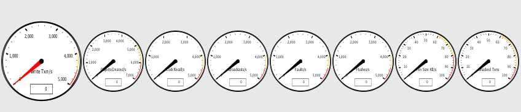
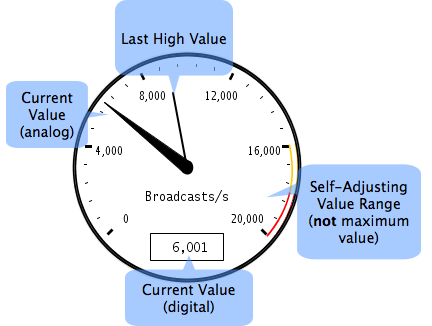

The cluster activity gauges provide real-time readings of crucial cluster metrics.

Each gauge has the following characteristics:

*   Yellow and red zones on the dial indicate when the metric value has reached warning or extreme levels.
*   A digital readout field displays the metric's current value.
*   A tooltip shows the metric's full name, last maximum value, and average value (over all samples).
*   By default, values are sampled over one-second intervals (except for **Unacked Txns**). The sample rate can be changed in the Options Dialog.
*   A "high-water" mark tracks the last high value, fading after several seconds.
*   A self-adjusting value range uses a built-in multiplier to automatically scale with the cluster.

The left-most gauge (the large dial with the red needle) measures the rate of write transactions, which reflects the work being done in the cluster, based on [Terracotta transactions](Concept+and+Architecture+Guide). 
This gauge may have a high value or trend higher in a busy cluster. An indication that the cluster may be overloaded or out of tune is when this gauge is constantly at the top of its range.

The remaining gauges, which measure "impeding factors" in your cluster, typically fluctuate or remain steady at a low value. If any impeding factors consistently trend higher over time, or remain at a high value, a problem may exist in the cluster. These gauges are listed below:

*   **Objects Created/s** – The rate of shared objects being created. A rising trend can have a negative impact on performance by reducing available memory and necessitating more garbage collection.
*   **Lock Recalls/s** – The number of locks being recalled by Terracotta servers. Growing lock recalls result from a high contention for shared objects, and have a negative performance impact. Higher locality of reference can usually lower the rate of lock recalls.
*   **Broadcasts/s** – The number of object changes being communicated by the server to affected clients. High broadcast rates raise network traffic and can have a negative performance impact. Higher locality of reference can usually lower the need for broadcasts.
*   **Faults/s** – Rate of faulting objects from servers to all connected clients. A high or increasing value can indicate one or more clients running low on memory or poor locality of reference.
*   **Flushes/s** – Rate of flushing objects from all connected clients to servers. A high or increasing value can indicate one or more clients running low on memory.
*   **Transaction Size KB/s** – Average size of total transactions.
*   **Unacked Txns** – The current count of unacknowledged client transactions. A high or increasing value can indicate one more troubled clients.